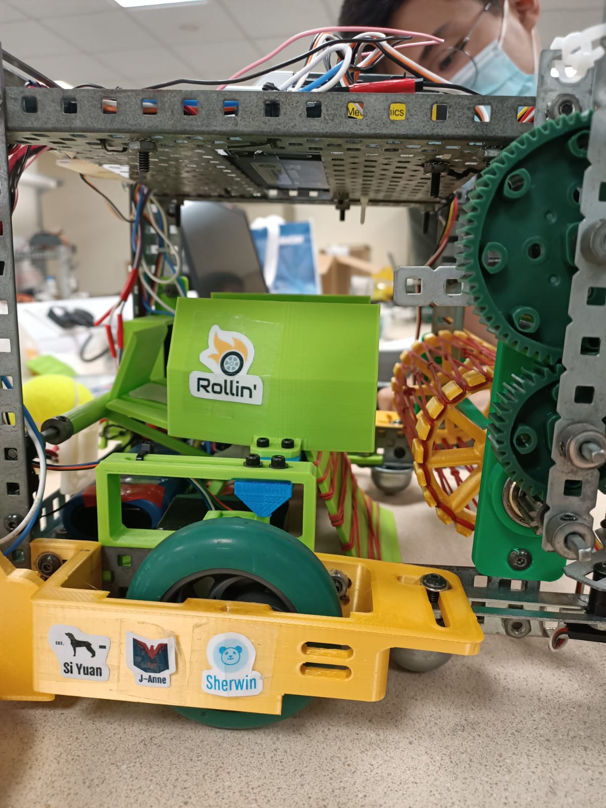

# MA4012-Competition
This repository contains the code for our group 3's robot for the MA4012 Competition

>

This code make use of RobotC and the following modules:
- [BNSBluetooth Library by JMarple](https://github.com/JMarple/BNSBluetooth)
